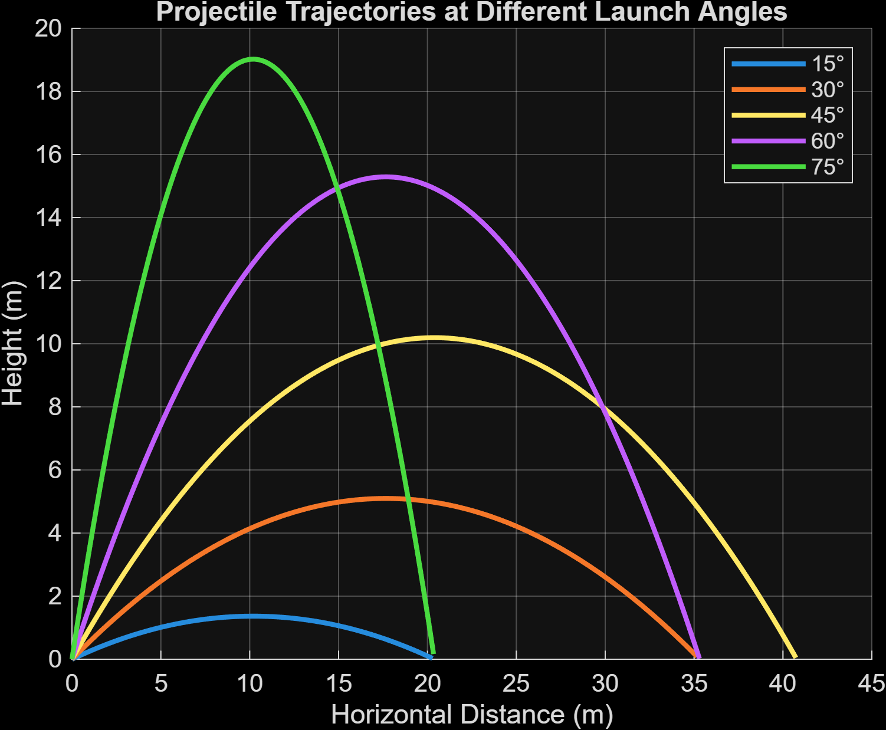

# Launch Trajectory Simulator

## Project overview

This project is a MATLAB engineering simulator that models the motion of a projectile after it is launched. I investigated how changing the launch angle and initial speed affects the horizontal range, maximum height and flight time.

## Engineering question

How do launch angle and initial speed affect the horizontal range, maximum height and flight time of a projectile?

## What the simulator calculates

The simulator calculates:

- Horizontal range
- Maximum height
- Flight time
- Horizontal and vertical velocity components
- Projectile trajectories
- The launch angle that produces the greatest range

## Test conditions

For the launch angle comparison, I used:

- Initial speed = 20 m/s
- Starting height = 0 m
- Gravity = 9.81 m/s²
- Launch angles = 15°, 30°, 45°, 60° and 75°

For the initial speed comparison, I used:

- Launch angle = 45°
- Initial speeds = 10, 15, 20, 25 and 30 m/s
- Starting height = 0 m
- Gravity = 9.81 m/s²

## Mathematical method

The simulator uses the equations for projectile motion.

Horizontal position:

x(t) = v₀ cos(θ)t

Vertical position:

y(t) = h₀ + v₀ sin(θ)t − 0.5gt²

The initial velocity is split into horizontal and vertical components using trigonometry:

vₓ = v₀ cos(θ)

vᵧ = v₀ sin(θ)

The model then uses these values to calculate the maximum height, flight time and horizontal range.

## Results

The results showed that 45° produced the greatest horizontal range for the tested launch angles.

The 30° and 60° launches produced approximately the same range, as did the 15° and 75° launches. This is because these are complementary angles and, under the assumptions of this model, they produce the same value of sin(2θ).

Increasing the launch angle increased the maximum height and flight time, while the horizontal range increased up to 45° and then decreased.

When the launch angle was kept at 45°, increasing the initial speed increased the range and maximum height according to the square of the speed, while flight time increased directly with speed.

## Project files

 — MATLAB code version [launch_trajectory_simulator.m](https://github.com/Kingdemide/launch-trajectory-simulator/blob/main/launch-trajectory-simulator/launch_trajectory_simulator.m)
 
 — MATLAB Live Script containing the full project [launch_trajectory_simulator.mlx](https://github.com/Kingdemide/launch-trajectory-simulator/blob/main/launch-trajectory-simulator/launch_trajectory_simulator.mlx)
 
 — Exported project report [launch_trajectory_simulator.pdf](https://github.com/Kingdemide/launch-trajectory-simulator/blob/main/launch-trajectory-simulator/launch_trajectory_simulator.pdf)
  
 — Trajectory comparison graph [trajectory_comparison.png](https://github.com/Kingdemide/launch-trajectory-simulator/blob/main/launch-trajectory-simulator/trajectory_comparison.png)

## How to run

Open [launch_trajectory_simulator.mlx](https://github.com/Kingdemide/launch-trajectory-simulator/blob/main/launch-trajectory-simulator/launch_trajectory_simulator.mlx) in MATLAB.

[Run the Live Script](https://github.com/Kingdemide/launch-trajectory-simulator/blob/main/launch-trajectory-simulator/launch_trajectory_simulator.mlx) using the **Run** button.

The script will calculate the projectile motion, compare different launch angles and initial speeds, produce graphs and perform validation checks.

## Model assumptions and limitations

The model assumes:

- Constant gravitational acceleration of 9.81 m/s²
- No air resistance
- No wind
- Flat ground
- The projectile is represented as a single point
- Horizontal acceleration is zero
- The projectile starts and lands at the same height

These assumptions make the model simpler than a real projectile. In reality, air resistance, wind and the physical shape of the projectile would affect its trajectory.

## Skills demonstrated

This project demonstrates:

- MATLAB programming
- Arrays
- For loops
- Conditional statements
- Preallocation
- Mathematical modelling
- Trigonometry
- Projectile physics
- Data analysis
- Graph creation
- Automated validation
- Engineering problem solving

## What I learned

I learned how MATLAB can be used to turn physics equations into a working simulation. I also learned how arrays and loops can make it much easier to test several different conditions without repeating the same calculations manually.

The project also helped me understand how launch angle and initial speed affect different parts of projectile motion.

## Future improvements

If I developed the simulator further, I could add:

- Air resistance
- Wind
- Different starting and landing heights
- An interactive MATLAB App Designer interface
- More realistic projectile models

## Trajectory comparison

